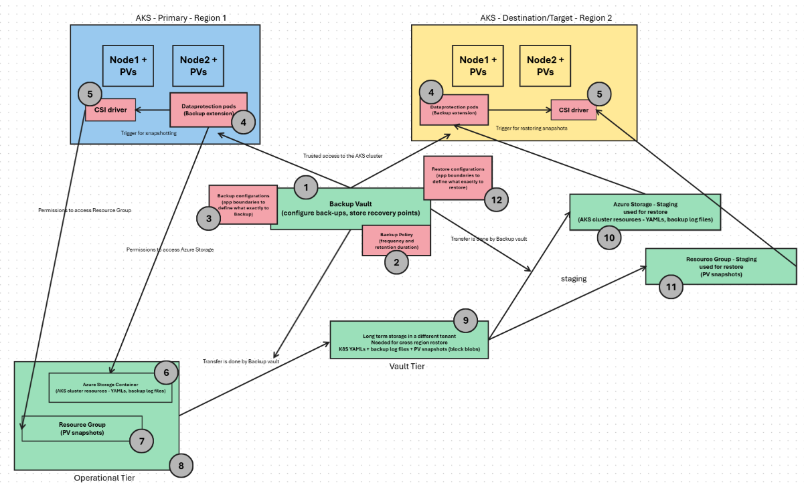

# Azure Backup for Azure Kubernetes Service (AKS) - The moving parts

Azure Backup for Azure Kubernetes Service (AKS) provides a very good and easy way to perform backup and restore operations for AKS.  
Comprehensive documentation on the same can be found at - [What is Azure Kubernetes Service (AKS) Backup? - Azure Backup | Microsoft Learn](https://learn.microsoft.com/en-us/azure/backup/azure-kubernetes-service-backup-overview)

There are a lot of components which work together for the operations of AKS-related backup and restore. This article in no way aims to replace the official documentation but is prepared to provide a quick glance on the components involved for Azure Backup for AKS.

There are in all 3 different artifacts which are backed-up (and later used for restore) in the case of Azure Backup for AKS as below:  
1. Kubernetes YAML files  
2. Backup log files  
3. PV snapshots

The below diagram showcases these components and their interaction with each other. Kindly note that the scenario depicted here is for Cross Region Replication where the source AKS cluster (Primary) and the destination/target AKS cluster meant for restore (Secondary), are in different regions.

---

## Description of the components - serial numbers mapped to the above diagram:

1. **Backup Vault**: Management plane to configure back-ups and store recovery points  
2. **Backup Policy**: To configure backup frequency and retention duration in the Backup Vault  
3. **Backup configuration**: To configure the scope of backup  - e.g. is it only a single namespace to be backed-up or is it multiple namespaces, etc.  
4. **Data protection pods (Backup extension)**: Pods provisioned on the System Node Pool of the AKS cluster as a result of installing the Backup extension  
5. **CSI driver**: Driver in Kubernetes to interface with a compatible storage system (Azure Disk in this case as Persistent Volume)  
6. **Azure Storage Container**: Used to store backed up AKS cluster resources like K8S YAMLs and backup log files.  
7. **Resource Group**: Used to store disk snapshots of the Persistent Volumes (PVs)  
8. **Operational Tier**: Azure Storage Container (component 6.) and Resource Group (component 7.) are collectively known as Operational Tier.  
9. **Vault Tier**: Contents of the Operational Tier are further copied to the Vault Tier for Cross Region Restore and Long Term storage (Operational Tier retains for 1 year).  
10. **Azure Storage - Staging**: Used as a staging location by the Vault Tier for storing backed up AKS cluster resources like K8S YAMLs and backup log files - during the restore operations.  
11. **Resource Group - Staging**: Used as a staging location by the Vault Tier for storing backed up disk snapshots of the Persistent Volumes (PVs) - during the restore operation.  
12. **Restore configuration**: To configure the scope of restore - e.g. is it only a single namespace to be restored or is it multiple namespaces, etc.  

---

## Configuration - in a nutshell:

a. **Backup Vault (1)** is to be created first, with the desired **Backup Policy (2)**.  
b. **Backup extension (4)** is to be installed on the Source AKS cluster (Primary - for Backup) and the Destination/Target AKS cluster (Secondary - for Restore).  
c. For backups - The **Backup extension (4)** is to be configured with the **Azure Storage Container (6)**, **Backup Vault (1)** along with the **Resource Group (7)**, the defined **Backup Policy (2)** and the desired **Backup configuration (3)**.  
d. For restore - from the **Backup center**, the desired backed up instance (and its desired restore point) which was backed up by the **Backup Vault (1)** is tied up with the Destination/Target AKS cluster (Secondary - for Restore). Either the **Vault Tier (9)** - for cross region restore - OR - **Operational Tier (8)** - for same region restore - is to be selected. The desired **Restore configuration (12)** is also set.

---

## Flow of events:

**Backup**  
a. **Backup Vault (1)** interfaces with the **Backup extension (4)** basis the configurations in the **Backup Policy (2)** for initiating the backup and basis the scope defined in **Backup configurations (3)**.  
b. **Backup extension (4)** on the source AKS cluster fetches the K8S YAMLs from the Source AKS cluster and the backup log files to the designated **Azure Storage Container (6)**. To perform the snapshots of the PVs, the **Backup extension (4)** makes use of the **CSI driver (5)**, which in-turn takes the snapshots and stores it in the **Resource Group (7)**.  
c. If a **Vault Tier (9)** is configured to be used (for Cross Region Restore), all the artifacts in the **Operational Tier (8)** are moved to the **Vault Tier (9)** by the **Backup Vault (1)**.

**Restore**  
a. The artifacts from the **Vault Tier (9)** are moved to the configured **Azure Storage - Staging (10)** and **Resource Group - Staging (11)**. This is done by the **Backup Vault (1)**.  
b. The **Backup extension (4)** on the Destination/Target AKS cluster restores the Kubernetes objects in the YAMLs stored in **Azure Storage - Staging (10)**. The **Backup extension (4)** also builds the PVs with the help of the **CSI driver (5)** from the snapshots stored in **Resource Group - Staging (11)**.  
c. In case the restore is happening to the Destination/Target AKS cluster which is in the same region as that of the Source AKS cluster, then the **Vault Tier (9)** and the associated **Azure Storage - Staging (10)** and **Resource Group - Staging (11)** are not needed. In case of the same region restore, the artifacts for the restore are directly picked up from the **Operational Tier (8)**.

## Acknowledgements
Sincere thank you for inputs, help and proof-reading: Rajat Shrivastava (https://github.com/rajats22)
